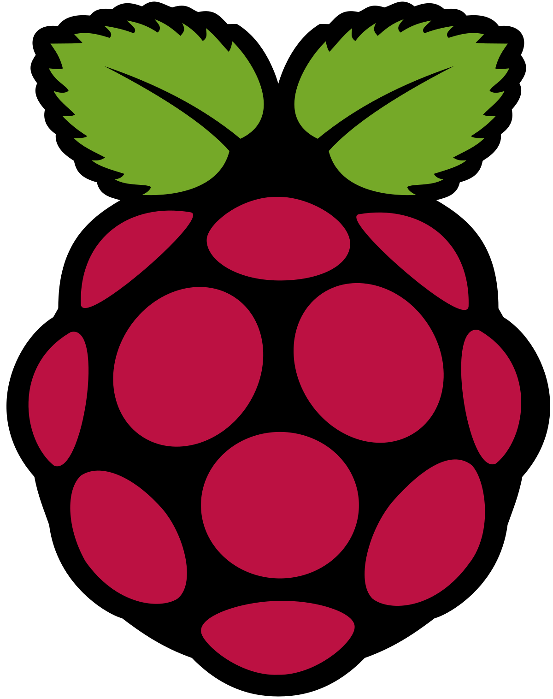
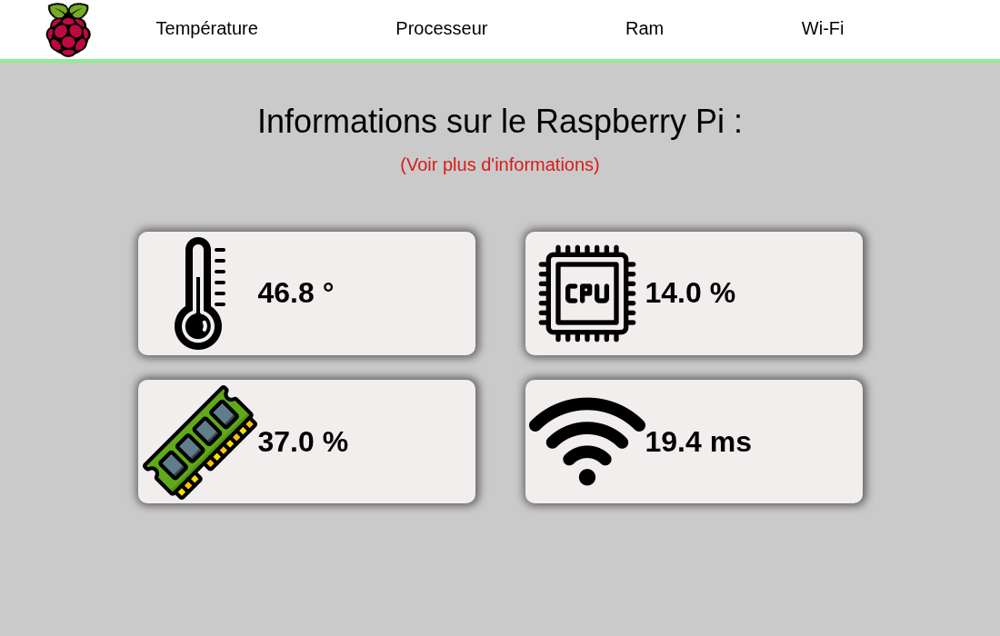

<div align="center">



# SiteStatsRaspberryPi

**Tableau de bord temps réel pour surveiller un Raspberry Pi** — température, CPU, RAM et latence réseau, servis via une petite API FastAPI et stockés en SQLite.




</div>

## Sommaire

- [Fonctionnement](#fonctionnement)
- [Configuration (.env)](#configuration-env)
- [Installation](#installation)
- [Lancer le projet](#lancer-le-projet)

## Fonctionnement

| Fichier | Rôle |
|---|---|
| `transfert_valeur.py` | Serveur **FastAPI** : sert le tableau de bord (`GET /`) et reçoit les mesures (`POST /api/measurements`, protégé par jeton) |
| `mesure_valeur.py` | À lancer **sur la même machine** que le serveur (le Pi lui-même) — écrit directement dans SQLite |
| `mesure_valeur_vps.py` | À lancer **depuis une machine distante** — envoie ses mesures au serveur en HTTP, authentifié par jeton |
| `db.py` | Accès à la base **SQLite** (table `data`) |
| `config.py` | Charge toute la configuration depuis `.env` — aucun identifiant en dur dans le code |
| `adminPI.html` | Template Jinja2 du tableau de bord |

```
┌────────────────────┐        direct (SQLite)        ┌──────────────────────┐
│  mesure_valeur.py   │ ─────────────────────────────▶│                      │
│  (sur le Pi)        │                                │  transfert_valeur.py │──▶ GET / (dashboard)
└────────────────────┘                                │  (serveur FastAPI)   │
                                                        │                      │
┌────────────────────┐   HTTP POST + jeton Bearer      │                      │
│ mesure_valeur_vps.py│ ─────────────────────────────▶│                      │
│  (machine distante)  │                                └──────────────────────┘
└────────────────────┘
```

## Configuration (.env)

Aucun secret n'est stocké dans le code. Copiez `.env.example` en `.env` et renseignez vos valeurs :

```bash
cp .env.example .env
```

```
DB_PATH=data.db
API_HOST=0.0.0.0
API_PORT=2006
API_TOKEN=            # générez-en un: python -c "import secrets; print(secrets.token_hex(32))"
API_URL=http://localhost:2006/api/measurements
PING_TARGET=google.com
```

`.env` est ignoré par git (voir `.gitignore`) et ne doit jamais être commité.

- Sur la machine qui héberge le serveur **et** `mesure_valeur.py` : renseignez `DB_PATH` et `API_TOKEN`.
- Sur une machine distante qui exécute `mesure_valeur_vps.py` : renseignez `API_URL` (adresse publique du serveur) et le même `API_TOKEN` que le serveur.

## Installation

```bash
git clone https://github.com/Estemobs/SiteStatsRaspberryPi.git
cd SiteStatsRaspberryPi
python -m venv venv
source venv/bin/activate
pip install -r requirements.txt
cp .env.example .env   # puis éditez .env
```

## Lancer le projet

1. **Démarrez le serveur** (crée aussi la base SQLite si besoin) :
   ```bash
   python transfert_valeur.py
   ```

2. **Collectez des données** :
   - Depuis le Raspberry Pi / la machine du serveur :
     ```bash
     python mesure_valeur.py
     ```
   - Depuis un serveur distant :
     ```bash
     python mesure_valeur_vps.py
     ```

3. **Ouvrez le tableau de bord** : [http://localhost:2006](http://localhost:2006)

> Astuce : planifiez `mesure_valeur.py` (ou `mesure_valeur_vps.py`) via une tâche cron pour une mise à jour périodique des mesures.
